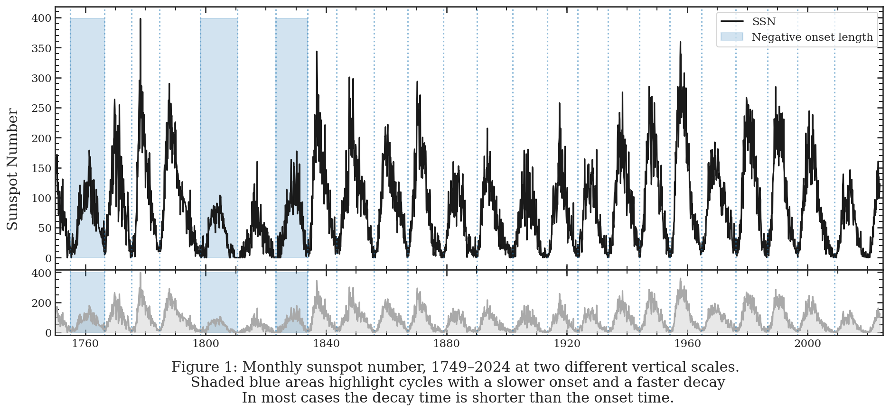

<h1>Do solar cycles emerge faster than they decay?</h1>

This repository contains Python code for analyzing solar cycle data, focusing on onset and decay times of solar cycles.
Purpose

The purpose of this project is to examine the onset and decay times of solar cycles and compare them statistically.

<h2>Data Sources</h2>

- Observed Solar Cycle Values: Data sourced from <a href="https://www.swpc.noaa.gov/products/solar-cycle-progression">SWPC</a>, providing observed solar cycle indices including sunspot numbers.
- List of Solar Cycles: Data pulled from <a href="https://en.wikipedia.org/wiki/List_of_solar_cycles">List of solar cycles, Wikipedia</a>, listing the start, maximum, and end dates of solar cycles.

<h2>Analysis</h2>

- Data Cleaning and Preprocessing: The data is cleaned and preprocessed to ensure consistency and accuracy for analysis.
- Onset and Decay Time Calculation: Onset and decay times for each solar cycle are calculated based on the provided data.
 - Visualisation: Various visualizations are created to illustrate the monthly sunspot numbers over time, highlighting cycles with slower onset and faster decay.
 - Statistical Analysis: Statistical tests, including a t-test, are conducted to compare the onset and decay times, indicating a significant difference between the two.
- Pairwise Relationships: Pairwise relationships between onset time, decay time, and cycle length are explored using scatter plots and histograms.

<h2>Conclusion</h2>

The analysis suggests a notable difference between the onset and decay times of solar cycles, indicating potential implications for understanding solar activity dynamics.

<h2>Requirements</h2>

- Python 3.x
- Libraries: pandas, matplotlib, numpy, seaborn, scipy

<h2>Contributors</h2>

<a href="https://louieleverett.co.uk/">Louie Leverett</a>

Science project inspired by: <a href="https://www.sciencebuddies.org/science-fair-projects/project-ideas/Astro_p017/astronomy/sunspot-cycles">Link</a>
